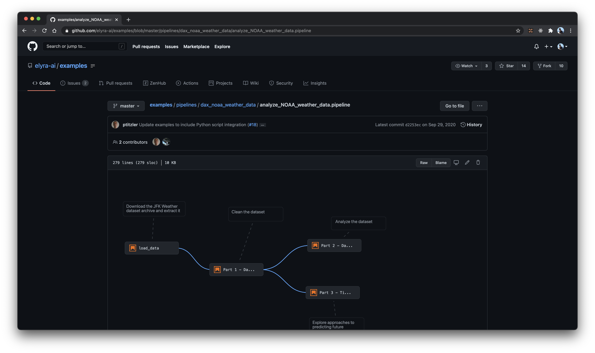

# Elyra Pipeline Viewer

This is the source code for the Elyra Pipeline Viewer extension.



## Installation

The easiest way to install this extension is through your browser's web store:
* [Chrome Web Store](https://chrome.google.com/webstore/detail/elyra-pipeline-viewer/blomglkicbbfkbmppeljdnnakajnpnop/)
* [Firefox Add-ons](https://addons.mozilla.org/en-US/firefox/addon/elyra-pipeline-viewer)

## Local development
You can also build and install this extension from source.

### Setup
Install the required npm dependencies:
```
yarn install
```

### Dev mode
In dev mode a sample pipeline and styles will be used to be rendered on a blank page. To start dev mode run:
```
yarn start
```

Then visit http://localhost:3000/

### Building and using extension
To use the project as an actual extension it must first be built and loaded into chrome. The project can be built by running:

```
yarn build
```

Once built, the contents of the extension will be bundled in the `build` directory.

Instructions for loading chrome extensions can be found [here](https://developer.chrome.com/docs/extensions/mv2/getstarted/). The relevant information has been copied below:

1. Open the Extension Management page by navigating to chrome://extensions.
   - The Extension Management page can also be opened by clicking on the Chrome menu, hovering over **More Tools** then selecting **Extensions**.
2. Enable Developer Mode by clicking the toggle switch next to **Developer mode**.
3. Click the **LOAD UNPACKED** button and select the extension directory.


After changes have been made to the extension, you must re-run `yarn build` to see the changes reflected in chrome.
